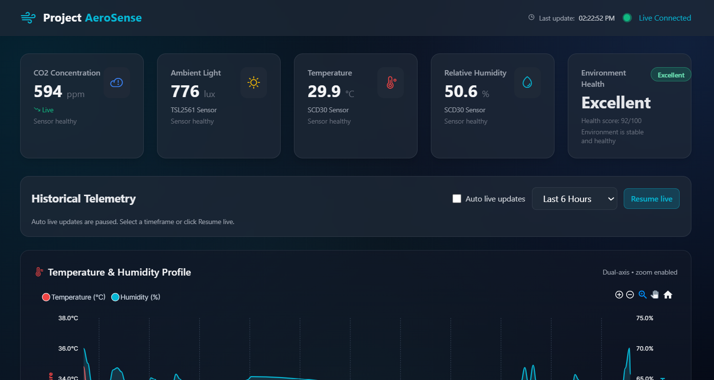
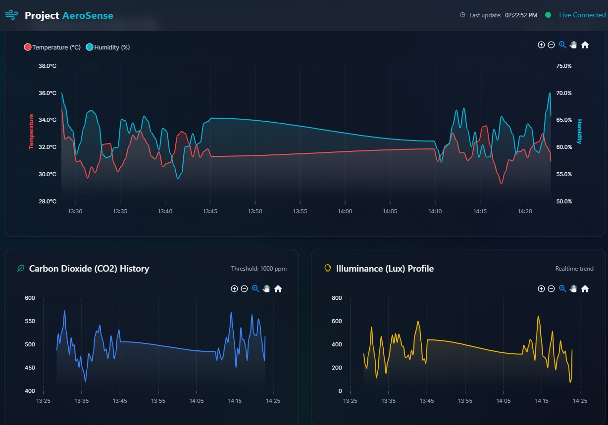

# 🍃 Project AeroSense
**Real-Time Full-Stack Environmental Telemetry System**


Project AeroSense is a complete end-to-end IoT solution designed to monitor environmental conditions with high precision. It features an ESP32-based edge node that reads CO2, temperature, humidity, and ambient light, publishing telemetry via MQTT. A Python Flask backend processes this data in real-time, stores it in a MySQL database, and broadcasts it via WebSockets to a sleek, interactive dashboard.

## ✨ Key Features
* **Precision Edge Sensing:** Utilizes the Sensirion SCD30 (NDIR CO2, Temp, Humidity) and TSL2561 (Luminosity) over dual hardware I2C buses.
* **Real-Time Telemetry:** MQTT payload transmission with a 5-second interval.
* **Full-Stack Architecture:** Python Flask backend with a MySQL database for historical data persistence.
* **Live Web Dashboard:** A responsive, dark-themed UI built with Tailwind CSS and ApexCharts, featuring live WebSockets (Socket.IO) updates.
* **Hardware Simulator:** Includes a Python-based MQTT simulator (`simulator.py`) for backend and frontend testing without physical hardware.

---
## 📸 Dashboard Preview


*Live telemetry dashboard showing real-time CO2, Temperature, Humidity, and Ambient Light.*


*Interactive ApexCharts plotting historical environmental data with dual-axis scaling.*

## 🏗️ System Architecture

1. **Edge Node:** ESP32 Dev Module (C++ / Arduino framework)
2. **Broker:** Reyax Cloud MQTT Broker
3. **Backend Server:** Python (Flask, Flask-SocketIO, Paho-MQTT, MySQL-Connector)
4. **Database:** MySQL
5. **Frontend:** HTML5, Tailwind CSS, ApexCharts.js, Phosphor Icons

---

## 🔌 Hardware Setup & Wiring
The ESP32 firmware utilizes two independent hardware I2C buses to prevent address conflicts and ensure stable communication.

| Sensor | ESP32 Pin | Function | Notes |
| :--- | :--- | :--- | :--- |
| **SCD30** | `3V3` | Power | Connect to 3.3V rail |
| | `GND` | Ground | Connect to GND rail |
| | `GPIO 21` | SDA (Bus 0) | I2C Data |
| | `GPIO 22` | SCL (Bus 0) | I2C Clock |
| **TSL2561**| `3V3` | Power | Connect to 3.3V rail |
| | `GND` | Ground | Connect to GND rail |
| | `GPIO 25` | SDA (Bus 1) | Secondary I2C Data |
| | `GPIO 26` | SCL (Bus 1) | Secondary I2C Clock |

---

## 🚀 Installation & Usage

### 1. Database Setup
Execute the following SQL command in your MySQL environment to create the required schema:
```sql
CREATE DATABASE iot_dashboard;
USE iot_dashboard;

CREATE TABLE sensor_data (
    id INT AUTO_INCREMENT PRIMARY KEY,
    timestamp DATETIME NOT NULL,
    temp FLOAT NOT NULL,
    humidity FLOAT NOT NULL,
    co2 FLOAT NOT NULL,
    lux FLOAT NOT NULL
);
```
### 2. Backend Server Setup & Configuration

**Folder Structure:**
Ensure your project directory is set up correctly. Flask requires the HTML dashboard to be inside a folder named `templates`.
```text
Project-AeroSense/
│
├── app.py                 # The main Flask server script
├── simulator.py           # The MQTT data simulator
└── templates/
    └── index.html         # The frontend dashboard
```
Before running the server, open app.py and update the Configuration section at the top of the file to match your environment.

#### 🗄️ Database Settings

Update the `DB_CONFIG` dictionary to point to your MySQL server. If you are running MySQL on the same machine, leave the host as `localhost`.
```python
DB_CONFIG = {
    'host': 'localhost',        # Change if your DB is hosted elsewhere (e.g., VPS IP)
    'user': 'your_db_user',     # Your MySQL username
    'password': 'your_db_pass', # Your MySQL password
    'database': 'iot_dashboard' # Must match the database you just created
}
```
#### 📡 MQTT Broker Settings
```python
MQTT_BROKER = "iot.reyax.com"       # Broker URL or IP Address
MQTT_PORT = 1883                    # Standard non-TLS MQTT port
MQTT_TOPIC = "greenhouse/telemetry" # Must match the topic in the ESP32 firmware
MQTT_USER = "your_mqtt_username"    # Your broker username
MQTT_PASS = "your_mqtt_password"    # Your broker password
```
Once configured, start the backend server:
```bash
python app.py
```
### 3. Edge Node Firmware (ESP32)

1. Open the `.ino` sketch in the Arduino IDE.
2. Install the following libraries via the Library Manager:
   * `PubSubClient`
   * `ArduinoJson` (v7+)
   * `SparkFun SCD30 Arduino Library`
   * `Adafruit TSL2561`
3. Update your Wi-Fi and MQTT Broker credentials in the configuration section of the code:
   ```cpp
   // --- CONFIGURATION ---
   // Wi-Fi Credentials
   const char* ssid = "YOUR_WIFI_SSID";
   const char* password = "YOUR_WIFI_PASSWORD";

   // MQTT Broker Settings
   const char* mqtt_server = "iot.reyax.com";
   const int mqtt_port = 1883;
   const char* mqtt_user = "YOUR_MQTT_USERNAME";
   const char* mqtt_pass = "YOUR_MQTT_PASSWORD";
   const char* mqtt_topic = "greenhouse/telemetry";
4. Flash the firmware to your ESP32 Dev Module.


